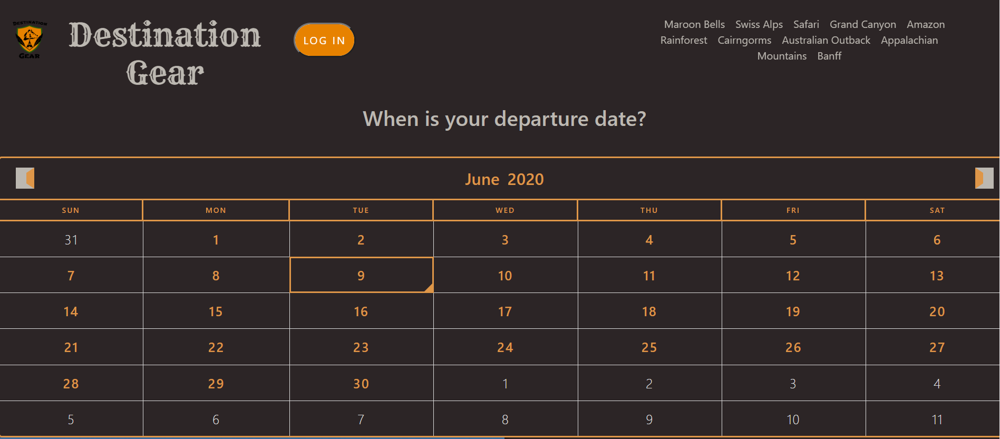

  # Destination Gear
  
  
  ## Description
  This application is for users who enjoy backpacking in several different environments. This will allow the user to track which backpacking gear they will need based upon the environment they will be in and the time of year. This application is fully mobile responsive and allows the user to log in and save their progress and notes to themselves for each different location.

  

  ## Table of Contents

  * Installation
  * Usage
  * License
  * Contributing
  * Tests
  * Questions
  
  Usage: 
  To use this application, the user will select the date of their departure, they will then be presented with an accurate time statement so they know how long they have to prepare for their trip. The user will then be able to scroll through the single page application to the destination of their choice and be presented a gear checklist on click of the image. The image and custom gear checklist will also consider the time of year the user chose and present accurate information and images.

  If the user would like to log in, they will be given the opportunity to create, save and delete reminders. These reminders will be stored in a MongoDB database and will only be presented to that user and categorized by each specific location.

  Contributing: 
  Destination Gear utilizes React, MongoDB, Express, Node, Sass, Auth0, Bootstrap, MomentJs and Mongoose.
  
  To run tests, run the following command: 
  npm test

  To install necessary dependencies run the following command: npm i
  
  License: 
  MIT
    
  Creator Github account: [GitHub](https://api.github.com/users/tsbolty)
  